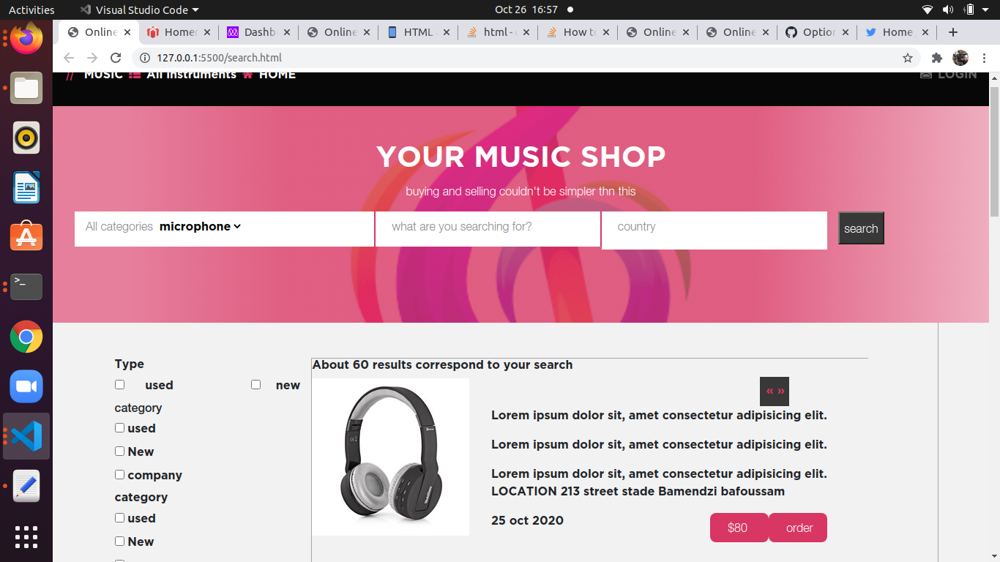
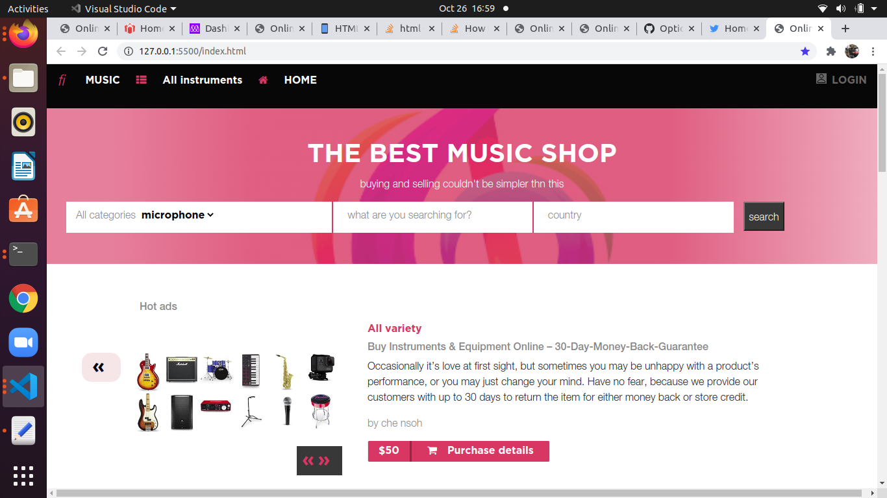

# Online-Shop-for-Musical-instruments
This is a capstone project for students at the end of html/css module . This project tests a sythensis of all what the stuents have learned.
 The  project is an online shop for musical instruments and the purpose is to make it responsive across the following viewports Large screens(laptots) medium screens(tablets) and small screens(Some some smart phones)
 

## Built With

- HTML & CSS
- BOOTSTRAP FRAMEWORK

## Getting started
    In order to run the project locally  clone the repository and open the index.html file in your preferred browser.

## Live Demo

- [Live Demo Link](https://che30.github.io/Online-Shop-for-Musical-instruments/)
- [Live Demo Video Link](https://www.loom.com/share/e64c08d965744f2aa05447fef479edf7)
 

## Author
**Che Blanchard**

- GitHub: [@che30](https://github.com/che30)
- LinkedIn: [Che Blanchard](https://www.linkedin.com/in/che-nsoh-9455271b0/)

## Acknowledgements
- The next web
- W3 schools
- Font awesome
- Stack overflow

##  Contributing

Contributions, issues, and feature requests are welcome!

## Show your support

Give a ⭐️ if you like this project!

## License

This project is [MIT](./LICENSE.txt) licensed.