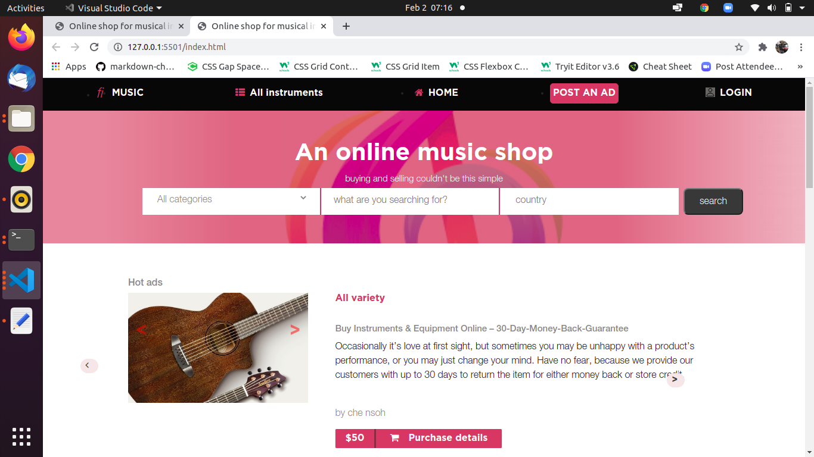

# Online-Shop-for-Musical-instruments
This is a capstone project for students at the end of the HTML/CSS module. This project tests a synthesis of all that the students have learned.
 The  project is an online shop for musical instruments and the purpose is to make it responsive across the following viewports Large screens(laptops) medium screens(tablets) and small screens(Some some smartphones)
 

## Built With

- HTML & CSS
- BOOTSTRAP FRAMEWORK

## Getting started
   To get a local copy up and running follow these simple example steps.
# Setup
- Clone the project locally.

- Linters
1. run npm install.
2. run npm run test to check the HTML and CSS files.
3. run npm run watch to start watching for SCSS changes.
4. Deployment
5. Install and run a live server plugin on your IDE/Text editor and run it from the root directory.

## Live Demo

- [Live Demo Link](https://che30.github.io/Capstone-Online-Shop-for-Musical-instruments/)

## Project discription
- [Live Demo Video Link](https://www.loom.com/share/e64c08d965744f2aa05447fef479edf7)
 

## Author
**Che Blanchard**

- GitHub: [@che30](https://github.com/che30)
- LinkedIn: [Che Blanchard](https://www.linkedin.com/in/che-nsoh-9455271b0/)
- Twitter:[che55085128](https://twitter.com/che55085128)

## Acknowledgements
- The next web
- W3 schools
- Font awesome
- Stack overflow

##  Contributing

Contributions, issues, and feature requests are welcome!

## Show your support

Give a ⭐️ if you like this project!

## License

This project is [MIT](./LICENSE.txt) licensed.